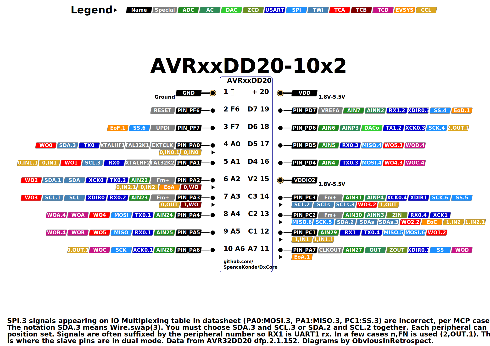
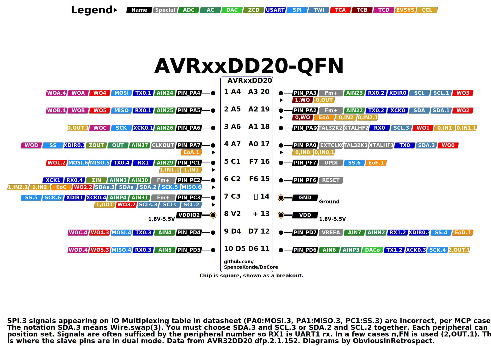

# AVR64DD20/AVR32DD20/AVR16DD20

## Pin Mapping / Pinout

## Features and Peripherals
| Feature                      | AVR16DD20       | AVR32DD20       | AVR64DD20       |
|------------------------------|-----------------|-----------------|-----------------|
| Flash Memory                 | 16384           | 32768           | 65536           |
| SRAM                         | 2048            | 4096            | 8192            |
| EEPROM                       | 256             | 256             | 256             |
| User Row                     | 32              | 32              | 32              |
| Max. Frequency (rated, MHz)  | 24              | 24              | 24              |
| Total pins on package        | 20              | 20              | 20              |
| Packages Available           | SOIC, VQFN20    | SOIC, VQFN20    | SOIC, VQFN20    |
| I/O Pins (pins w/out reset)  | 15 (17)         | 15 (17)         | 15 (17)         |
| Of those, MVIO pins          | 3               | 3               | 3               |
| PWM capable I/O pins         | 13              | 13              | 13              |
| Max simultaneous PWM outputs | 8: 6+0+2 *      | 8: 6+0+2 *      | 8: 6+0+2 *      |
| 16-bit Type A Timer (TCA)    | 1               | 1               | 1               |
| 16-bit Type B Timer (TCB)    | 2               | 2               | 2               |
| 12-bit Type D Timer (TCD)    | 1               | 1               | 1               |
| USART (pin mappings)         | 2 (5, 2)        | 2 (5, 2)        | 2 (5, 2)        |
| SPI (pin mappings)           | 1 (5)           | 1 (5)           | 1 (5)           |
| TWI/I2C                      | 1               | 1               | 1               |
| 12-bit ADC input pins        | 12              | 15/19           | 15/19           |
| Of those, neg. diff. inputs  | All             | All             | All             |
| 10-bit DAC                   | 1               | 1               | 1               |
| Analog Comparator (AC)       | 1               | 1               | 1               |
| Zero-Cross Detectors (ZCD)   | 1               | 1               | 1               |
| Opamp                        | NO              | NO              | NO              |
| Custom Logic Blocks (LUTs)   | 4               | 4               | 4               |
| Event System channels        | 6               | 6               | 6               |

* If targeting the most PWM channels, the only option for the two TCBs overlaps with pins that TCA can use in it's most favorable spot.

## AVR DD - This is more akin to a souped up tinyAVR than an poverty model Dx
The 20 and 14 pin DD-series parts first releeased ase 32 and 16k parts, are much more exciting than their larger brothers, because they bring in Dx-class features at a price barely exceeding that of a similar tinyAVR. They're much cheaper than DB-series, barely above ATtiny parts, but come with most of the full suite of features. Obviously some things were cut versus the DB: Memory is halved (they're still cheap I compared avr32DD32's to AVR32DB32'as); 16/32/64 flash with 2/4/8k of SRAM. Amd there is only 1 analog comparator and no USART2. Just 0 and 1. Similarly, we're down to just one SPI and I2C peripheral. On the other hand, the pin multipleximg options of USART0 and SPI0 have gotten luxury treatment. Note also that the alternate pin mapping numbers don't start at 1. For SPI, alt 1 and 2 are not available, nor is the ALT1 mapping of USART available.... but ALT2 is, placing TX and RX on PD6 and PD7 respectively. Arriving "fashionably late" to the portmux party, poor USART1 arrived to find that USART0 and SPI0 had already eaten the whole cake, drained the punchbowl, and left. They were left sucking on icecubes and licking up crumbs, along with TCA0 and TCD0, each picking up one mux option.  USART2 missed the event altogether, and it's unknown when he'll next be seen. TCA1 on the other hand seems to have made arragements behind the scenes, and despite her absence at the DD-portmux party, has ensured that she will do well when the EA comes along.

### USART0 mux options
| USART0  |  TX |  RX | XDIR | XCK |
|---------|-----|-----|------|-----|
| DEFAULT | PA0 | PA1 |  PA2 | PA3 |
| ALT1    | PA4 | PA5 |  PA6 | PA7 |
| ALT2    | PA2 | PA3 |   -  |  -  |
| ALT3    | PD4 | PD5 |  PD6 | PD7 |
| ALT4    | PC1 | PC2 |  PC3 |  -  |

### USART1 mux options
| USART1  |  TX |  RX | XDIR | XCK |
|---------|-----|-----|------|-----|
| DEFAULT | PA0 | PA1 |  PA2 | PA3 |
| ALT2    | PD6 | PD7 |   -  |  -  |

### SPI0 mux options
| SPI0    | MOSI | MISO | SCK |  SS |
|---------|------|------|-----|-----|
| DEFAULT |  PA4 |  PA5 | PA6 | PA7 |
| ALT4    |  PD4 |  PD5 | PD6 | PD7 |
| ALT5    |   -  |  PC1 | PC2 | PC3 |
| ALT6    |  PC1 |  PC2 | PC3 | PF7 |

### TCB mux options
Not much of a choice
| TCBn | Default | Alt |
|------|---------|-----|
| TCB0 |    PA2  |  -  |
| TCB1 |    PA3  |  -  |

### TCD mux options
| TCD0    | WOA | WOB | WOC | WOD |
|---------|-----|-----|-----|-----|
| DEFAULT | PA4 | PA5 | PA6 | PA7 |
| Alt4    | PA4 | PA5 | PD4 | PD5 |

### TCA mux options
| TCA0    | WO0 | WO1 | WO2 | WO3 | WO4 | WO5 |
|---------|-----|-----|-----|-----|-----|-----|
| PORTA   | PA0 | PA1 | PA2 | PA3 | PA4 | PA5 |
| PORTC   |  -  | PC1 | PC2 | PC3 |  -  |  -  |
| PORTD   |  -  | -   |  -  |   - | PD4 | PD5 |

### TWI mux options
| TWI0    | Master or Slave | Dual Mode Slave |
|---------|-----------------|-----------------|
| DEFAULT | SDA/PA2 SCL/PA3 | SDA/PC2 SCL/PC3 |
| ALT1    | SDA/PA2 SCL/PA3 | Not avail.      |
| ALT2    | SDA/PC2 SCL/PC3 | Not avail.      |
| ALT3    | SDA/PA0 SCL/PA1 | SDA/PC2 SCL/PC3 |

Like TCA, 1.5.0 of DxCore, if you set the TCD portmux (PORTMUX.TCD0ROUTEA), digitalWrite and analogWrite() will be aware of it (digitalWriteFast is never aware of PWM, don't use it to shut off PWM, it won't).

Until I get some of these in my hands I can't check a few other things. But there don't appear to be any fundamental changes here.

28-pin diagram done first because that's what I reckon most people will be using first.
